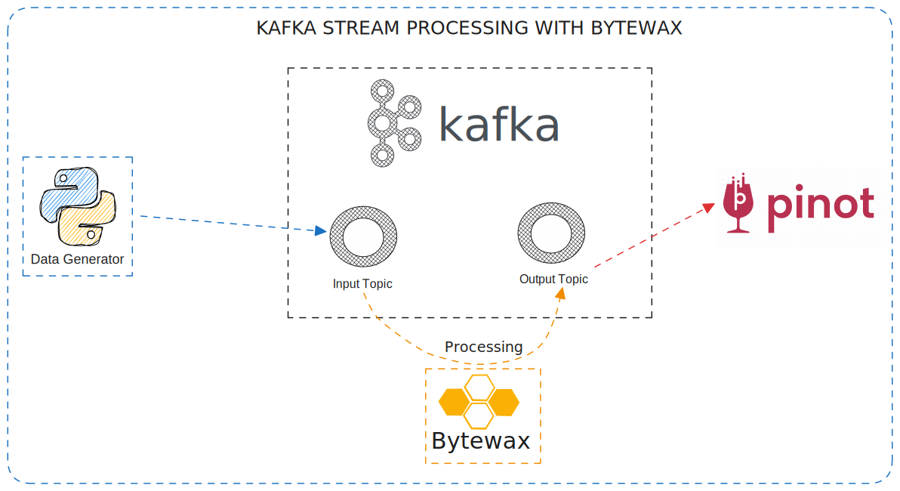
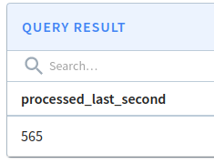
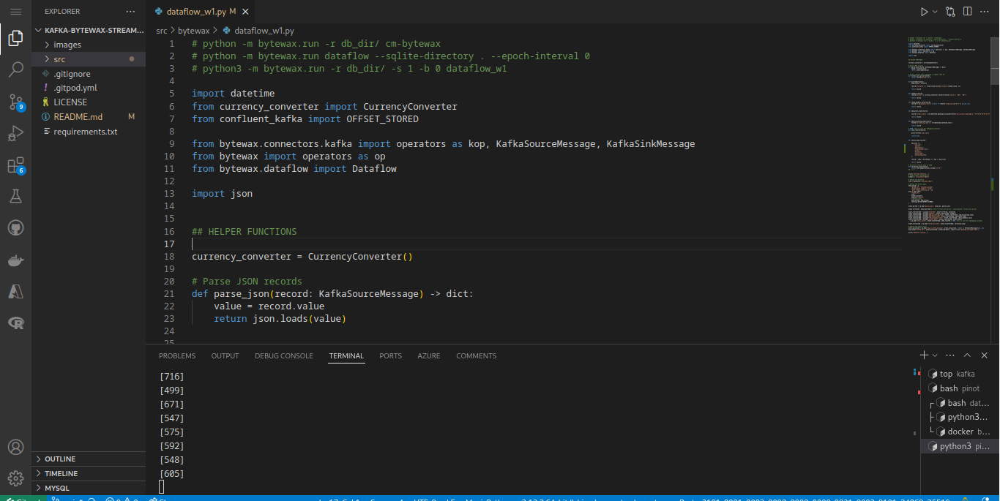

<a name="readme-top"></a>

<!-- PROJECT LOGO -->
<br />
<div align="center">

  <h3 align="center">Kafka Stream Processing with Bytewax</h3>

  <p align="center">
    Processing rides events from Kafka with Bytewax
  </p>
</div>

<br>
<p align="justify">
&ensp;&ensp;&ensp;&ensp;This repo contains a basic event processing example. The idea was to play around with Bytewax for event processing from Kafka. Bytewax is a lightweight, easy to install, and easy to deploy tool for real-time pipelines.
</p>

<br>

<!-- TABLE OF CONTENTS -->
## Contents

<details>
  <summary>Expand</summary>
  <ol>
    <li>
      <a href="#about-the-project">About The Project</a>
      <ul>
        <li><a href="#business-context">Business Context</a></li>
        <li><a href="#development-plan">Development Plan</a></li>
        <li><a href="#built-with">Built With</a></li>
        <li><a href="#solution-description">Solution Description</a></li>
        <li><a href="#results-found">Results Found</a></li>
        <li><a href="#next-steps">Next Steps</a></li>
      </ul>
    </li>
    <li>
      <a href="#getting-started">Getting Started</a>
      <ul>
        <li><a href="#quick-tip">Quick Tip</a></li>
        <li><a href="#prerequisites-and-installations">Prerequisites and Installations</a></li>
        <li><a href="#reproducing">Reproducing</a></li>
      </ul>
    </li>
    <li><a href="#license">License</a></li>
    <li><a href="#acknowledgments">Acknowledgments</a></li>
  </ol>
</details>

<br>

<!-- ABOUT THE PROJECT -->
## About The Project

<p align="center">
  
</p>

<p align="justify">
&ensp;&ensp;&ensp;&ensp;Making real-time data pipelines is really very challenging, since we have to deal with data volume changing, latency, data quality, many data sources, and so on. Another challenge we usually face is related to the processing tools: some of them can't process event-by-event, some of them are too expensive in a real fast scenario, and the deployment of some of them are really challenging. So, in order to better make decisions about our data stack, we have to properly understand the main options availables for storing and processing events.
</p>

<p align="justify">
&ensp;&ensp;&ensp;&ensp;In this way, the purpose of this repo is to get in touch with some stream processing capabilities of Bytewax. To achieve this goal, we ran a Kafka cluster in Docker and then produced fake ride (something like Uber's ride) data to a topic. Then, a Bytewax dataflow consumed those records, performed some transformations, and then saved the refined data into another topic.
</p>

<p align="right">(<a href="#readme-top">back to top</a>)</p>

### Business Context

<p align="justify">
&ensp;&ensp;&ensp;&ensp;In order to be more business-like, we created a fake business context.
</p>

<p align="justify">
&ensp;&ensp;&ensp;&ensp;Our company <strong>KAB Rideshare</strong> is a company that provides ride-hailing services. Due to a recent increase in the number of users, KAB Rideshare will have to improve their data architecture and start processing the rides events for analytical purposes. So, our Data Team was given the task of implementing an event processing step. The company already stores all the events in a Kafka cluster, so our task is just to choose and implement the processing tool.
<br>
&ensp;&ensp;&ensp;&ensp;After some time of brainstorming, we decided to start with a MVP using a lightweight, but very powerful tool: Bytewax. In this, way, we can get the results quickly so the analytical team can do their job. Once we have gained this time, we can better evaluate other solutions.
</p>

<p align="right">(<a href="#readme-top">back to top</a>)</p>

### Development Plan

<p align="justify">

- Implement the Data Gen
- Deploy a Kafka cluster on Docker for testing purposes
- Implement the Bytewax Dataflow

</p>

<p align="right">(<a href="#readme-top">back to top</a>)</p>

### Built With

<!-- <p align="center">
  
</p> -->


- <a href="https://www.python.org/" target="_blank">Python 3.12.3</a>
- <a href="https://kafka.apache.org/" target="_blank">Apache Kafka</a>: for event streaming
- <a href="https://bytewax.io/" target="_blank">Bytewax</a>: for event processing
- <a href="https://docs.pinot.apache.org/" target="_blank">Apache Pinot</a>: perform some simples analytical queries


<p align="right">(<a href="#readme-top">back to top</a>)</p>

### Solution Description

<p align="justify">
&ensp;&ensp;&ensp;&ensp;We'll shortelly describe the workflow so you can better understand it.
</p>

<p align="justify">
&ensp;&ensp;&ensp;&ensp;First of all, we needed some data. In this way, we developed a simple data generator using Python that loads data into a Kafka topic. This generator was based on a more complex one we developed in <a href="https://engenhariadedadosacademy.com/"> Engenharia de Dados Academy</a>. The data contains some columns about source, destination, ride price, user id and stuff like that.
</p>

<p align="justify">
&ensp;&ensp;&ensp;&ensp;The next step was the resource provisioning. Using Docker Compose, we ran a Kafka cluster and Apache Pinot locally. Finally, we developed the bytewax processing. It performs the following computations:
</p>

1. miles to kilometers convertion
2. USD to BRL convertion
3. add processing time
4. add event time (convert timestamp to datetime string)
5. add dynamic fare flag
6. filter desired columns

<p align="justify">
&ensp;&ensp;&ensp;&ensp;As an aditional step we ran queries on pinot for checking the processed events from Bytewax.
</p>

<p align="right">(<a href="#readme-top">back to top</a>)</p>


### Results Found
<p align="justify">
&ensp;&ensp;&ensp;&ensp;Bytewax seems very interesting. With a simple worker running in the terminal with python, it was capable of processing an average of 500 events per second as shows the image bellow:
</p>

<p align="center">
  
</p>

<p align="right">(<a href="#readme-top">back to top</a>)</p>


<!-- NEXT STEPS -->
## Next Steps

From now on, we'll deploy both Kafka, bytewax, and the data generator to a Kubernetes cluster so we can better explore real world scenarios and the Bytewax scaling capabilities.
</p>

<p align="right">(<a href="#readme-top">back to top</a>)</p>


<!-- GETTING STARTED -->
## Getting Started

<p align="justify">
&ensp;&ensp;&ensp;&ensp;You'll find in this section all the steps needed to reproduce this solution.
</p>

### Quick tip

<p align="justify">
&ensp;&ensp;&ensp;&ensp;I'm using <a href="https://www.gitpod.io/" target="_blank">Gitpod</a> to work on this project. Gitpod provides an initialized workspace integrated with some code repository, such as Github. In short, it is basically a VScode we access through the browser and it already has Python, Docker, and some other stuff installed, so we don't need to install things in our machine. They offer a free plan with up to 50 hour/mo (no credit card required), which is more than enough for practical projects (at least for me).
</p>

<p align="center">
  
</p>

<p align="right">(<a href="#readme-top">back to top</a>)</p>

### Prerequisites and Installations

* <a href="https://docs.docker.com/engine/install/" target="_blank"> Docker</a> and <a href="https://docs.docker.com/compose/install/" target="_blank"> Docker Compose</a>

* <a href="https://docs.bytewax.io/stable/guide/getting-started/installing.html" target="_blank"> Bytewax</a>

<p align="justify">
For other Python's dependencies, please refer to the `requirements.txt`, there we have all dependencies we needed.
</p>

<p align="right">(<a href="#readme-top">back to top</a>)</p>

### Reproducing

1. Clone the repo:
    ```sh
    git clone https://github.com/KattsonBastos/kafka-bytewax-streaming.git
    ```

2. Create a Python's virtual environment for Bytewax (I'm using virtualenv for simplicity) and activate it:
    ```sh
    python3 -m virtualenv env
    source env/bin/activate
    ```

3. Install Python's packages with the following command:
    ```sh
    pip install -r requirements.txt
    ```

4. Provision the resources (Kafka and Pinot):
    ```sh
    cd src/build/
    docker compose up -d
    ```

5. Create Kafka Topics: <br>
    <p align="justify">
    We'll need two topics: `input-raw-rides`, for events from the data generator, and another for refined events `output-bytewax-enriched-rides`.
    First, we need to access the container:
    </p>

    ```
    docker exec -it broker bash
    ```
    Then, create both topics:
    ```
    kafka-topics --create --topic=input-raw-rides --bootstrap-server=localhost:9092 --partitions=3 --replication-factor=1

    kafka-topics --create --topic=output-bytewax-enriched-rides --bootstrap-server=localhost:9092 --partitions=3  --replication-factor=1

    ```

6. Start the data generator:
    ```sh
    cd src/data-gen-topic/

    bash run.sh input-raw-rides
    ```

    <p align="justify">
    Remember that `input-raw-rides` is the the topic we want to save the events into.
    </p>

7. Start the Bytewax dataflow (remember to activate the env created in the second step):
   ```sh
   python3 -m bytewax.run dataflow
    ```

    If you want more workers, run the following command (refer to the Bytewax docs for more):
    ```sh
   python3 -m -w bytewax.run dataflow
    ```

    Here you can play with Bytewax for checking its performance.

8. Check the refined events
    Here you can do one or many (it's up on you):
  
    - go to the kafka Control Center (port 9021) and take a look at the topic;

    - access the container and run the following command:
      ```sh
      kafka-console-consumer --bootstrap-server=localhost:9092 --topic=output-bytewax-enriched-rides
      ```

    - <p align="justify">Or you can create a table in apache pinot and play with the data. To do so, just run the script `src/pinot/run.sh` and then check the table in Pinot Controller (port 9000). If you prefer, you can also run the python script `src/pinot/query.py`. Make sure to replace the query with yours.</p>

<p align="right">(<a href="#readme-top">back to top</a>)</p>

<!-- LICENSE -->
## License

Distributed under the MIT License. See `LICENSE.txt` for more information.

<p align="right">(<a href="#readme-top">back to top</a>)</p>


<!-- ACKNOWLEDGMENTS -->
## Acknowledgments

* <a href="https://www.youtube.com/watch?v=567kiizOY1U&t=3452s" target="_blank">Use-Case: Analisando Corridas do Uber em Tempo-Real com Kafka, Faust, Pinot e SuperSet | Live #80</a>: all the data transformations and the general idea of this repo was based on the referred live stream. The main difference is that here we changed the processing tool from Faust to Bytewax.
* <a href="https://github.com/bytewax/bytewax/tree/main/examples" target="_blank">Official bytewax examples</a>: they present amazing examples so we can easily get in touch with the tool.

<p align="right">(<a href="#readme-top">back to top</a>)</p>
